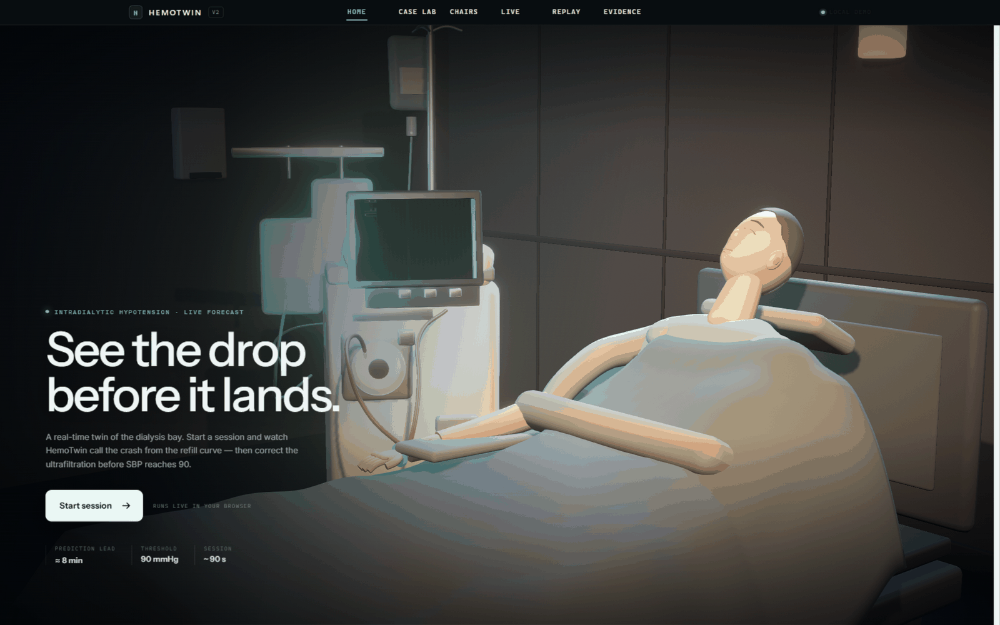
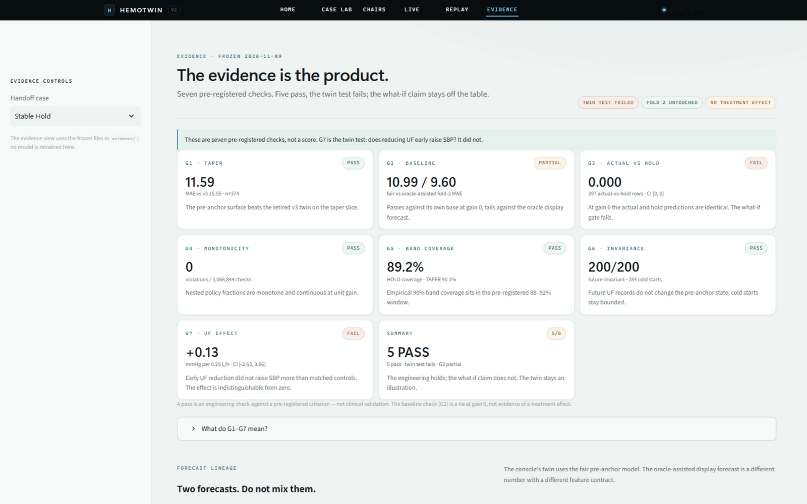
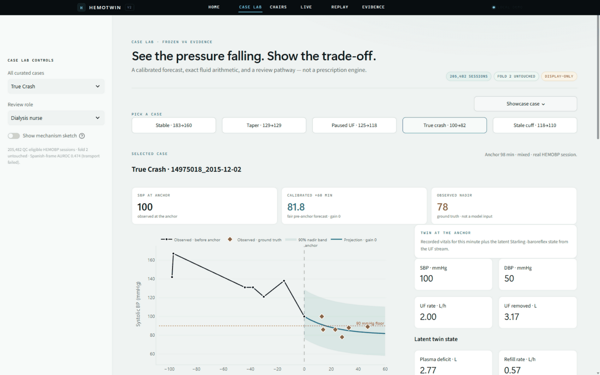
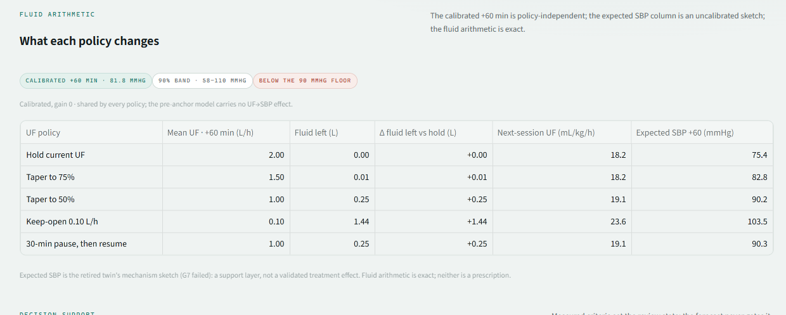
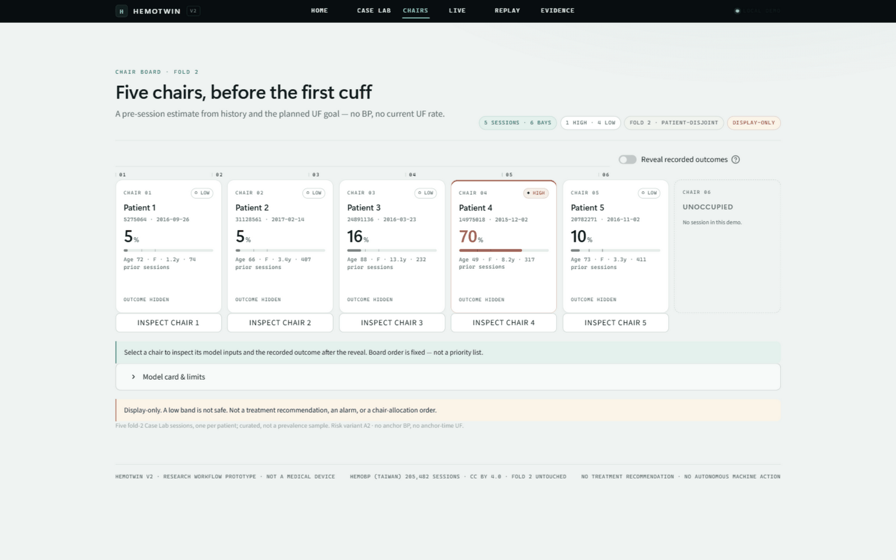
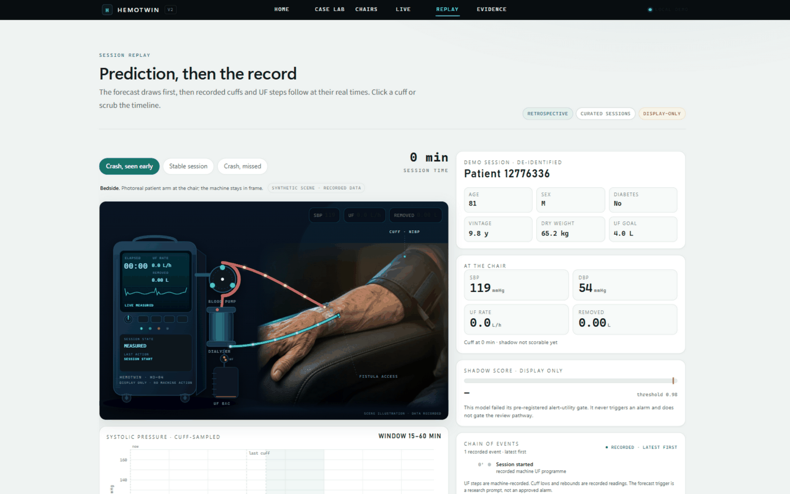
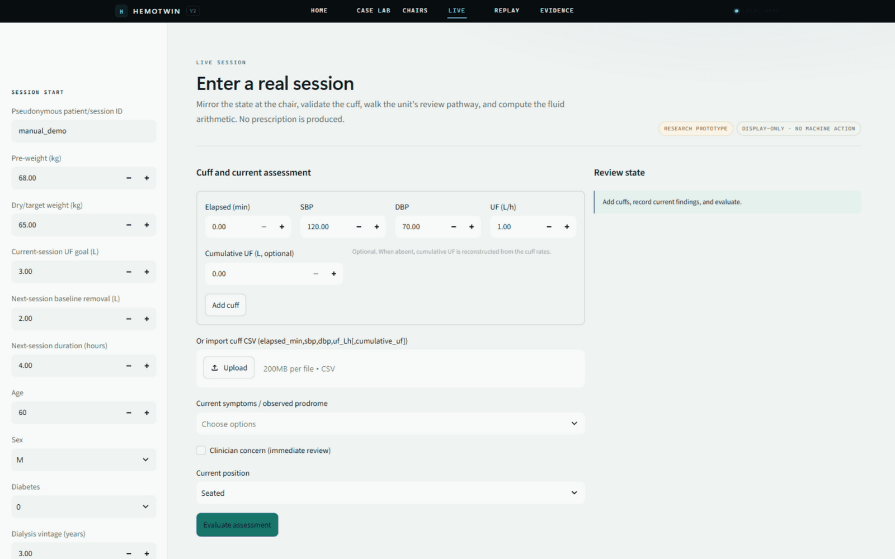
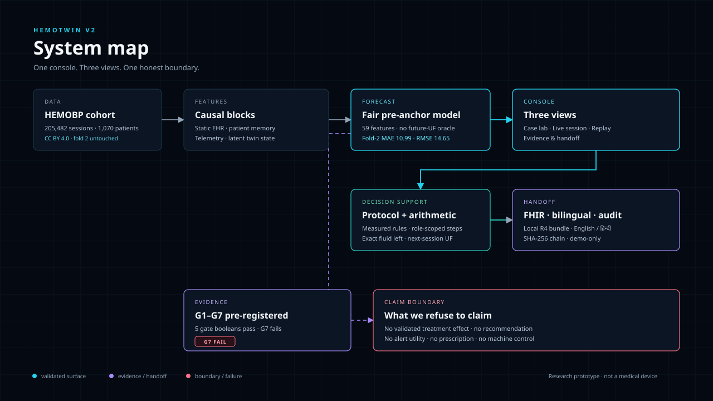

# HemoTwin

**HemoTwin mirrors a dialysis session while it runs.** It flags who is likely to
crash today before the first cuff is taken, forecasts the systolic blood-pressure
drop about an hour before it lands, and turns every ultrafiltration choice into
exact fluid arithmetic — so the technician at the chair can take better decisions or call the
remote doctor earlier.



> **Research prototype. Not a medical device. No treatment-effect or
> clinical-benefit claim.** Seven pre-registered checks: four pass, one is
> partial, and **two fail — G3 (the twin effect) and G7 (the twin test)**. We
> ship both failures honestly. Fold 2 was never touched by tuning.

## What the twin does

In dialysis, blood pressure often falls mid-session — a "crash" (systolic below
90 mmHg) — while the doctor is remote and the technician at the chair has to
decide first. HemoTwin shadows that session end to end:

- **Before the session — Chair board.** Scores all five chairs from patient
  history and the planned UF goal alone — no BP has been taken yet, no current
  UF rate. One chair comes up high, four low; recorded outcomes stay hidden
  behind a reveal. Untouched-fold AUROC **0.8313**.
- **During the session — Case lab & Live view.** A calibrated forecast of the
  systolic pressure **+60 min ahead** (MAE **10.99 mmHg** on patients the model
  never saw), drawn as a fan chart against the 90 mmHg floor next to the
  observed cuffs — with a stale-cuff guardrail when readings go quiet.
- **The crash score — ranking, not an alarm.** At every cuff the v3 model ranks
  the risk of the first SBP<90 in the next 15–60 minutes. On the retrospective
  patient-disjoint test it reached **AUROC 0.923** and caught **75.1%** of crash
  sessions at an **18.2%** false-alarm session rate. It is a **shadow display**
  only; needs more work to use it as a reliable alarm system.
- **At the decision — fluid arithmetic.** Taper, hold, or pause the UF: every
  option is priced against the same calibrated projection (i.e it shows the trafeoff of different choices), and the table shows
  exactly what changes in the UF schedule and the fluid carried forward.
  Display-only — nothing adjusts the machine.
- **After the session — Replay & Evidence.** Watch the forecast compete against
  the recorded cuffs minute by minute, then open the evidence ledger: seven
  pre-registered checks, including the two twin failures.

---

## The numbers

### Models

| Model | Result | Role in the console |
|---|---|---|
| **Pre-anchor forecast** — 59 features, no future-UF oracle | **Fold-2 MAE 10.99 mmHg** · RMSE 14.65 | the calibrated forecast shown at the chair |
| Oracle-assisted display forecast — 72 features incl. 13 observed future-UF | Fold-2 MAE 9.60 | display-only card; **not** the G2 baseline |
| **Chair-board pre-session risk** (A2 variant, LightGBM) | **Fold-2 AUROC 0.8313** · recall@25 0.6015 · PPV@25 0.5914 · ECE10 0.0184 | five-chair board; no anchor BP, no anchor-time UF |
| Crash-shape timing (P(early onset \| crash)) | Fold-2 AUROC 0.7716 · PPV@25 0.6615 | second line of the risk card |
| **Crash-risk ranking** (v3, 62 features) | **Test AUROC 0.923** (95% CI 0.906–0.937) · **75.1%** of crash sessions caught at an **18.2%** false-alarm session rate | ranking / shadow display; **not an alarm** |

The 0.923 is a retrospective ranking result, not a catch rate. The strict online
alarm test is in [When the crash model was tested as a live alarm](#when-the-crash-model-was-tested-as-a-live-alarm).

The v3 62-feature artifacts (3-seed LightGBM + isotonic) are bundled under
[`models/event_model_v3/`](models/event_model_v3/). Files: `v3_m0.txt`,
`v3_m1.txt`, `v3_m2.txt`, `v3_isotonic.json`, `v3_meta.json`. The Live session
still uses the 48-feature universal Task-02 scorer; the v3 model is a historical
ranking artifact, not the default live scorer.

### The data behind them

**205,482** QC-eligible HEMOBP sessions (Taiwan, CC BY 4.0) ·
**1,070** patients · **4.19M** telemetry rows.

### The seven pre-registered checks (G1–G7)

Written down **before** looking at the results. They are not a score, and you
do not need them to use the console.

| Check | Result | Headline number |
|---|---|---|
| G1 · beats the retired v3 twin on the taper slice | **pass** | 11.59 vs 15.55 MAE (n=374) |
| G2 · honest against its own baseline | **partial** | 10.99 fair vs 9.60 oracle — passes at gain 0, fails against the oracle display |
| G3 · twin predicts an actual effect | **FAIL** | 0.000 — identical to simply holding UF |
| G4 · policy stays monotone and continuous | **pass** | 0 violations in 3,086,844 checks |
| G5 · 90% bands cover reality | **pass** | 89.2% HOLD · 90.1% TAPER coverage |
| G6 · future-invariant, bounded cold starts | **pass** | 200/200 invariance · 284 cold starts |
| **G7 · the twin test** — does early UF reduction raise SBP? | **FAIL** | **+0.13 mmHg per 0.25 L/h** · 95% CI [−2.63, +3.06] · sham control +2.91 |



### The forecasts are not interchangeable

The console uses the **fair 59-feature pre-anchor model (10.99)**. The **9.60**
number is an oracle-assisted display forecast that consumes 13 observed
future-UF features; it appears only on the display-only card and is **not** the
G2 baseline. Comparing 9.60 to 10.99 as if they were the same model is wrong.

### How the crash model compares with published work

The **0.923** is an internal, retrospective ranking result. It is **not** a
like-for-like win over published IDH predictors, because the tasks differ.

| Work | Cohort and horizon | Split | AUROC | What it also reports |
|---|---|---|---|---|
| **HemoTwin v3** | HEMOBP Taiwan · 1,070 patients / 205,482 sessions · **15–60 min** | patient-disjoint 70/15/15 | **0.923** (0.906–0.937) | 75.1% retrospective detection at 18.2% false-alarm sessions |
| Zhang et al., *NDT* 2023 | 693 US patients / 42,656 sessions · **15–75 min** | session-randomized 80/20; patient-randomized 80/20 | **0.887 / 0.876** | 65% sensitivity at 90% specificity per SBP; 73.4% session sensitivity at 78% specificity |
| Dong et al., *CMPB* 2023 | multicentre | internal | **0.82** | LightGBM, Fall30/Nadir90 definitions |
| Hong et al., *Sci Rep* 2026 (meta-analysis) | 19 studies | mixed | **0.86 pooled** (0.83–0.89) | high heterogeneity; single-cohort and inconsistent definitions are the main weakness |

Our horizon is narrower (15–60 vs 15–75), which is an easier task; the cohort
and case mix differ; our split is patient-disjoint; and both our model and
Zhang's are single-cohort internal evaluations. Against Zhang's
patient-randomized split (0.876), our 0.923 is higher, but the horizon and
cohorts still differ — it is not a like-for-like win. At the closest
session-level operating point, our **75.1% detection at 18.2% false-alarm
sessions** is comparable to Zhang's **73.4% sensitivity at 78.0%
specificity**; our PPV is lower (30.6% vs 39.1%) because our test-split crash
prevalence is about half (8.6% vs 16.1%).

**Honest claim:** the 0.923 sits in the upper range of published single-cohort
results, and our split is stricter than Zhang's session-randomized headline. We
do not claim to beat the field. A fair head-to-head would need the same label,
horizon, cohort and external validation.

The 0.923 model is scored at a cuff. It is **not** the pre-session Chair-board
model: the Chair board's AUROC 0.8313 answers a different, harder question — no
BP and no current UF — and is not comparable to 0.923.

Comparators: Zhang et al., *Nephrol Dial Transplant* 2023
(doi:10.1093/ndt/gfad070); Dong et al., *Comput Methods Programs Biomed* 2023
(PMID 37429246); Hong et al., *Sci Rep* 2026 meta-analysis (PMID 42386817).

---

## What is in the console

One Streamlit app — the 3D-bay landing plus five views:

| View | What it does |
|---|---|
| **Home** | A live 3D dialysis bay running in the browser — the twin's stage, not a decoration. Scroll past it into the console. |
| **Case lab** | Six curated chair-side stories: stable hold, taper, paused UF, true crash, stale cuff, taper showcase. Calibrated fan chart, observed ground truth, per-cuff click inspection, fluid arithmetic, protocol state, 4-block causal state vector, TreeSHAP attribution. |
| **Chair board** | Five patient-disjoint fold-2 chairs at session start. Pre-session A2 risk (history + static fields + planned UF goal; no BP or current UF), fixed chair order, recorded crash shape behind a reveal. Display-only; not an allocation order. |
| **Live session** | Enter a real session and cuffs (or import a CSV). Validation, stale-cuff guardrail, deterministic protocol state, arithmetic fluid scenario, display-only forecast, local audit append. |
| **Session replay** | The forecast draws first; recorded cuffs and UF steps then roll forward at their real times beside a bedside scene. Click a cuff or scrub the timeline. |
| **Evidence & handoff** | Checks scoreboard, twin-test forest plot, mechanism checks, temporal-order diagnostic, frozen protocol hash, claim boundary, FHIR R4 bundle, bilingual English/हिन्दी handoff card, SHA-256 audit chain. |









The Chair board's model card, feature audit and claim boundary are in
[`docs/CRASHRISK.md`](docs/CRASHRISK.md). The crash shape is recorded only
after the reveal, not predicted.

The app has **no authentication, no role enforcement, no machine integration,
no external notification, and no network call at runtime**. The audit chain is
a local demo object, not an immutable clinical record. The fan chart's shaded
band is the **90% nadir interval, widened along the path for display** — not a
per-minute confidence band. The UI calls the point forecast **calibrated +60
min** rather than "nadir", because in some sessions the forecast is above the
anchor. For a stale cuff, the projection and fluid arithmetic are withheld.



---

## Run it

Clone, install, run — that is the whole setup. No raw data, no lab artifacts,
and no Node.js: the 3D bay ships prebuilt.

```bash
git clone <this repo> && cd HemoTwin
pip install -r requirements.txt
streamlit run app/hemotwin.py
```

Validated with Python 3.14 and the versions in `requirements.txt`
(Streamlit 1.66.1, Plotly 6.8.0, pandas 3.0.2, LightGBM 4.6.0).

If you edit the bay's source in `sim/`, the next `streamlit run` rebuilds it
automatically — Node.js required, and `npm install` runs by itself on that
start. `python scripts/sync_sim.py` forces the same rebuild anytime.

### Tests and checks

```bash
python -m unittest discover -s tests -t .     # 236 tests, 0 failures
python scripts/verify_claim_boundary.py       # frozen gates + claim boundary
python scripts/verify_package.py              # assets, links, artifacts, size
```

The heavy-lab skip count depends on the optional artifacts present: 28 in
this lean workspace, 6 with the full portable data/artifact pack.

### Three-minute demo

1. **Chairs** → five fold-2 chairs, outcomes hidden. "Pre-session risk: one
   high, four low — and no BP or current UF was read." Reveal: the high chair
   crashed; the four low chairs did not. *A curated story, not an accuracy estimate.*
2. **Case lab** → pick *True crash*: forecast 81.8, observed nadir 78. Hover a
   cuff for the calibrated and observed SBP; click it for SBP, DBP, UF and the
   twin state at that minute.
3. **Fluid arithmetic** → every policy shares the calibrated +60 min projection;
   the table shows what changes in the UF schedule and fluid carried forward.
4. **Evidence** → the checks scoreboard, the failed twin test (G7), the claim
   boundary, the FHIR bundle, the audit chain.
5. **Replay** → watch the forecast draw first, then the recorded cuffs and UF
   steps roll forward.
6. **Live** → load the example cuffs (`demo/live_session_demo.csv`) and
   evaluate; the forecast is `manual_limited` and the state comes only from
   measured rules.

---

## The boundary

**We can claim:** a calibrated pre-anchor nadir forecast; exact fluid
arithmetic; a deterministic, versioned review pathway; honest negative results
from the twin tests and the oracle baseline comparison; a local FHIR export and
a hash-chained demo audit.

**We refuse to claim:** a validated what-if/treatment effect from the twin;
that any UF policy will raise SBP, prevent IDH, or is minimum effective; alert
utility, clinical benefit, or a safety layer; prospective, external,
symptomatic-IDH, or Indian-unit validation; a prescription, a default dose, or
autonomous machine action.

The boundary is part of the product. It is why the rest is trustworthy.

## When the crash model was tested as a live alarm

The **AUROC 0.923** and **75.1%** above are retrospective ranking results. We
also tested the same model family under a pre-registered online rule:

- score every cuff;
- allow one alert per 60 minutes at most (non-resetting refractory);
- count an alert as timely only if the first SBP<90 starts 15–60 minutes later;
- cap non-useful alerts at **0.25–0.26 per session** — about one nuisance alert
  every four sessions.

**When tested against this rule, the result was 8.2% timely detection** (strict
AUROC 0.880). A simple current-SBP rule reached about 20% at a comparable or
lower nuisance burden. That is why the crash model is a **shadow display only**
and never fires an alarm. The 0.923 is a ranking result; the 8.2% is the
live-alarm result. Full protocol and numbers:
[`docs/EVIDENCE_STATUS.md`](docs/EVIDENCE_STATUS.md).

---

## Package map

```
├── app/                 one Streamlit app: shell + five views
│   ├── hemotwin.py      entrypoint and navigation
│   ├── manual_app.py    Live session body
│   ├── ui/              theme, charts, shell
│   └── views/           Case lab, Chair board, Session replay, Evidence & handoff
├── sim/                 3D bay source (Vite + three.js + Blender scene);
│                        rebuilt into app/static/sim/ automatically on
│                        streamlit start — scripts/sync_sim.py forces it
├── assets/              brand mark + replay/replay.html
├── src/                 forecast serving, protocol engine, fluid arithmetic,
│                        v4 twin, G7 identification, FHIR, audit
├── models/              bundled weights (no raw data): forecast_v2, physiotwin_v4,
│                        event_model, event_model_v3, crashrisk A2
├── evidence/            frozen reports, G7 protocol + hash, demo + per-cuff JSON,
│                        chair_risk.json, crashrisk confirm files
├── demo/                curated playback bundle, audit chain, example session CSV
├── config/              versioned research protocol
├── docs/                architecture, evidence status, facts, model card,
│                        CRASHRISK, QA, design notes + img/ (screenshots)
├── tests/               package test suite
├── scripts/             verifiers + lab provenance tools
├── deck/                HemoTwin_Story.pptx (10 slides) · HemoTwin_Signal.pptx (6 slides)
└── report/              HemoTwin_System_Brief.pdf + HTML source
```



---

## Deck and brief

- [HemoTwin_Story.pptx](deck/HemoTwin_Story.pptx) — 10 slides, 16:9: the field reality, why prediction alone fails, the console, the failed twin experiment, the claim boundary, the pilot ask
- [HemoTwin_Signal.pptx](deck/HemoTwin_Signal.pptx) — 6-slide signal cut for a short pitch
- [HemoTwin_System_Brief.pdf](report/HemoTwin_System_Brief.pdf) — A4 system brief ([HTML source](report/system_brief/hemotwin_brief.html))

## Documentation

- [Evidence status and claim boundary](docs/EVIDENCE_STATUS.md)
- [Facts and copy source](docs/FACTS.md)
- [Model card](docs/MODEL_CARD.md)
- [Chair-board risk (CRASHRISK)](docs/CRASHRISK.md)
- [Architecture](docs/ARCHITECTURE.md)
- [Design notes](docs/DESIGN.md)
- [Judge Q&A](docs/QA.md)

---

## Data and licence

HEMOBP (Lin et al., *Sci Data* 2019) is de-identified and released under
**CC BY 4.0**. Raw data is not committed. The repository contains derived
evidence, model weights, and curated demo sessions only. The app makes no
network call at runtime.

No Indian cohort has been collected or evaluated. Deployment in India would
require retraining on partner-machine data and local recalibration.

---

## Background

Built by an engineer working on a remotely operable, IoT-enabled haemodialysis
machine. In the units it serves, the doctor is often remote while a technician
or dialysis specialist is at the chair. IDH is one of the most common and
risky events of a session, and the person at the chair often has to act before
a doctor can be reached. The gap is not another score — it is **time** and a
**shared trade-off**. The design target is the chair-side technician, not the
nephrologist; the product buys enough time to react and seek advice, and never
replaces the clinician.

**Research prototype. Not a medical device. No treatment recommendation.**
